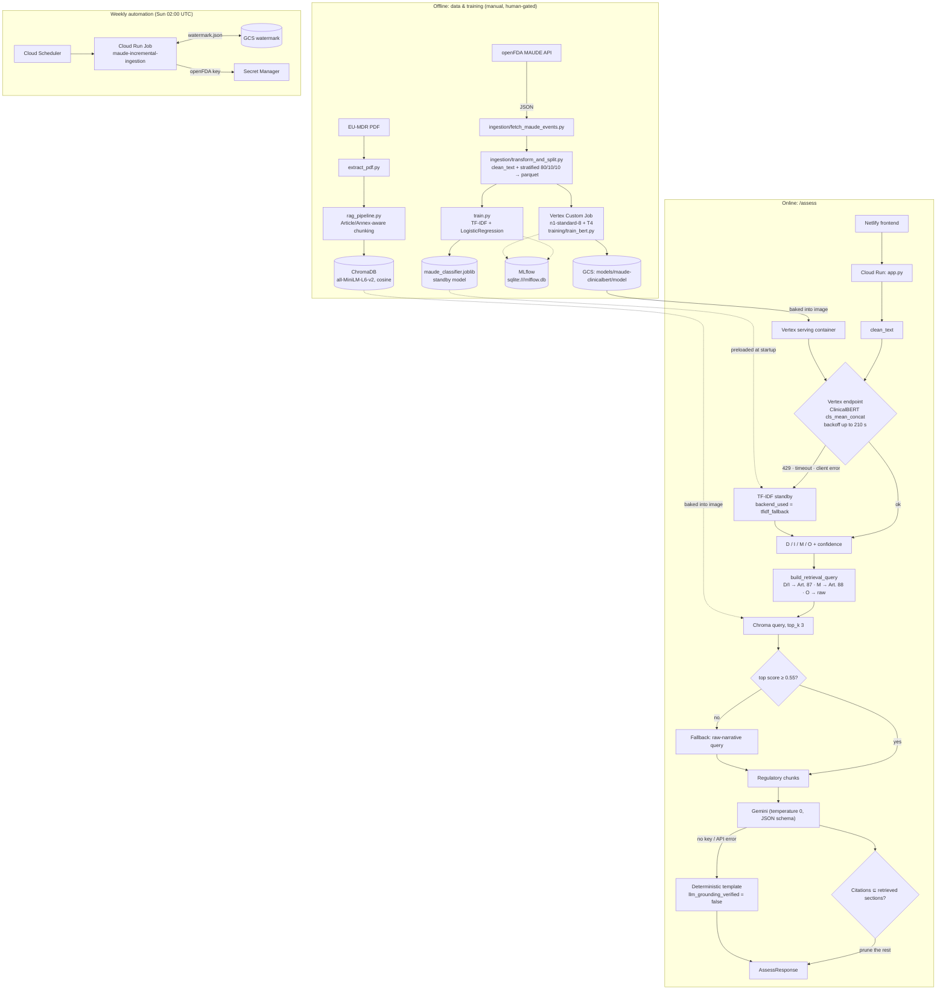

# Architecture

This document describes the system as it is built today. Every value in it was checked against the code on 2026-09-26. For endpoint schemas, see [API.md](API.md). For the reasoning behind each design choice and the alternatives rejected, see [INTERVIEW_NOTES.md](INTERVIEW_NOTES.md).

## At a glance

The system has **two serving services, one training pipeline and one scheduled job**, all in GCP `asia-south1` (project `regulatory-copilot-506507`).

| Component | Runs on | Entry point | Role |
| :--- | :--- | :--- | :--- |
| **API** | Cloud Run (scale-to-zero) | `app.py` (FastAPI) | `/classify`, `/retrieve`, `/assess`, `/health`; orchestrates everything below |
| **Classifier serving** | Vertex AI Endpoint `4702516673997963264`, `n1-standard-4`, 0–1 replicas | `maude_classifier/serve.py` | Fine-tuned Bio_ClinicalBERT (`cls_mean_concat` pooling) behind `/predict` |
| **Training** | Vertex AI Custom Job, `n1-standard-8` + 1× NVIDIA T4 | `training/train_bert.py` | Fine-tunes the classifier; the promoted checkpoint goes to GCS |
| **Ingestion** | Cloud Run Job, triggered weekly by Cloud Scheduler | `ingestion/fetch_maude_events.py` | Pulls new MAUDE reports from openFDA, tracked by a date watermark |
| **Frontend** | Netlify | `frontend/` (Vite + React) | Calls the Cloud Run API cross-origin (`*.netlify.app` allowed by CORS) |

## Request flow: `POST /assess`

1. **Classify with a warm standby.** The API calls the Vertex endpoint. The endpoint scales to zero, so the client retries with a backoff (base 3.0 s) for up to 210 s to ride out a cold start. On a 429, a timeout, a gRPC error or a failure to create the client, it degrades to the TF-IDF model preloaded at startup. The response says which backend answered (`backend_used`) and carries a `warning` when it degraded. It never fails silently.
2. **Decision point 1: label-conditioned retrieval.** Death and Injury steer the query toward Article 87 (vigilance timelines). Malfunction steers toward Article 88 (trend reporting). Other uses the raw narrative.
3. **Decision point 2: retrieval quality gate.** If the best steered match scores below cosine 0.55, the raw narrative is retried, and whichever result set scores higher is used. The retriever also drops any chunk below 0.45 before the gate sees it.
4. **Grounded recommendation with citation containment.** Gemini (`gemini-3.8-flash`) writes the recommendation from the retrieved chunks only, using structured JSON output at temperature 0. Any cited section that wasn't actually retrieved is pruned, and the response carries a warning. If there's no `GEMINI_API_KEY` or the call fails, a deterministic template answers instead and `llm_grounding_verified` is `false`.

Every request logs one structured line recording the label, confidence, classifier backend, whether the retrieval fallback ran, whether the LLM verified its citations, the citations, and the latency.

## Classifier

| | Primary | Standby |
| :--- | :--- | :--- |
| Model | Bio_ClinicalBERT, concatenated CLS + attention-masked mean pooling (`Bio_ClinicalBERT-cls_mean_concat-v1`) | TF-IDF + Logistic Regression |
| Where it runs | Vertex AI custom container (`maude_classifier/serve.py`, port 8080) | Inside the Cloud Run API process |
| Trained by | `training/train_bert.py` on Vertex (max length 256) | `train.py`, locally |
| Evaluated by | `scripts/evaluate_test.py` on the held-out test split | `train.py` |

Both models use the same `maude_classifier/text_cleaner.clean_text` as the training data (applied in `transform_and_split.py`), so preprocessing is identical at training and inference time.

## RAG layer

- **Corpus:** Regulation (EU) 2017/745 (EU-MDR). `extract_pdf.py` turns the PDF into `eu_mdr_text.txt`. Running `python rag_pipeline.py` splits the text on Article and Annex headers, chunks each section into 350-word windows with a 50-word overlap, tags every chunk with its section title, and writes it to a persistent ChromaDB collection at `./chroma_db`.
- **Embeddings:** `all-MiniLM-L6-v2` via `sentence-transformers`, with cosine distance.
- **Grounding:** citations are only valid if they match the section titles of the chunks actually retrieved for that request (`rag_recommender.py`). That check is enforced in code, not left to the prompt.
- `chroma_db/` is treated strictly as an ephemeral build artifact and is excluded from version control.
- Canonical legal text (`eu_mdr_text.txt`, ~660KB) is versioned in Git.
- On container cold start, `app.py` checks `collection.count() == 0`. If empty, it automatically triggers `rag_pipeline.ingest_document("eu_mdr_text.txt")`, embedding chunks with `all-MiniLM-L6-v2`.

## Training & promotion

1. `fetch_maude_events.py --mode full` pulls the historical baseline from openFDA.
2. `transform_and_split.py` cleans the narratives, maps them to D / I / M / O and writes stratified 80/10/10 `train` / `val` / `test` parquet files. It also writes `reports/dataset_split_metrics.json`.
3. `train.py` fits the TF-IDF standby. `training/submit_vertex_job.py` submits `train_bert.py` as a Vertex Custom Job (`training/Dockerfile.train`).
4. The ClinicalBERT checkpoint is evaluated on the test split and promoted to `gs://regulatory-copilot-506507-vertex-training/models/maude-clinicalbert/model`.
5. `scripts/deploy_vertex_model.py` uploads the serving image (`maude-artifacts/maude-serving:v1`) to the Vertex Model Registry and deploys it to the endpoint.

Runs are tracked in MLflow in the `eu-mdr-event-classification` experiment. Earlier runs were backfilled from `reports/` with `scripts/backfill_mlflow.py`; see [EXPERIMENT_TRACKING.md](EXPERIMENT_TRACKING.md).

**Nothing retrains or redeploys automatically.** Promotion is a deliberate manual step, which is the change-control posture a regulated medical-device context calls for; see [REGULATORY_MAPPING.md](REGULATORY_MAPPING.md).

## Weekly ingestion

Cloud Scheduler (`maude-weekly-ingest-trigger`) starts the `maude-incremental-ingestion` Cloud Run Job every Sunday at 02:00 UTC. The job:

- reads the last-ingested date from `gs://…/ingestion/watermark.json`
- pulls up to 5 batches of 100 reports newer than that date, sorted by `date_received`
- de-duplicates the reports by `report_number`
- advances the watermark

The job runs as a dedicated service account with only the permissions it needs (`run.invoker`, object access on the artifact bucket, and the ability to read the `OPENFDA_API_KEY` secret). It uses 512 Mi of memory and gets 2 retries. HTTP and network errors exit non-zero, so a failed pull shows up as a failed job rather than a quiet no-op. Deployment is scripted in `scripts/deploy_ingestion_job.sh`, and `cloudbuild.yaml` builds the image.

## Container images

One multi-stage `Dockerfile` produces three images. **Always pass `--target`**: the last stage is `ingestion`, so a build without it produces the ingestion image.

| Target | Base | Contents | Build |
| :--- | :--- | :--- | :--- |
| `cloudrun` | `python:3.12-slim` + CPU PyTorch | Whole app, TF-IDF `.joblib`, `chroma_db/` | `docker build --target cloudrun -t <tag> .` |
| `vertex` | `python:3.12-slim` + CPU PyTorch | `maude_classifier/` + checkpoint copied from GCS at build time | `docker build --target vertex --secret id=gcp-creds,src=<adc.json> -t <tag> .` |
| `ingestion` | `python:3.12-slim` | `ingestion/` + `requests`, `google-cloud-storage` only | `gcloud builds submit --config cloudbuild.yaml` |
| *(training)* | `pytorch/pytorch:2.1.2-cuda12.1` | `maude_classifier/` + `training/` | `training/Dockerfile.train` |

Runtime dependencies are in `requirements.txt`. Test and offline-tooling dependencies (`pytest`, `mlflow`, `pdfplumber`) are in `requirements-dev.txt`.

### Vector Feature Registry & Parity Control

#### Scope & Operating Boundaries
Cloud Run deploys run in an ephemeral container environment with no persistent volume or GCS FUSE mount. Consequently, production cold starts rebuild the index fresh from the checked-in `eu_mdr_text.txt` and current runtime code. 

The primary failure mode guarded by the Vector Feature Registry is **local development drift**: developers switching branches or altering chunking constants (`DEFAULT_CHUNK_SIZE`, `DEFAULT_OVERLAP`) while persisting stale SQLite indexes locally at `./chroma_db`.

#### Registry Schema (`<persist_directory>/registry.json`)
The registry is written inside `ingest_document()` strictly after `collection.add()` completes:
- `embedding_model`: Model name string (`all-MiniLM-L6-v2`).
- `embedding_dimension`: Dimension measured by passing a probe vector to `embedding_fn` during ingestion (`384`).
- `chunk_size` / `chunk_overlap`: Runtime chunking parameters (`350` / `50`).
- `source_file`: Corpus filename (`eu_mdr_text.txt`).
- `source_content_hash`: SHA-256 byte digest of the source text at ingest.
- `chunk_count`: Actual chunk count written to the store.
- `ingested_at`: UTC ISO timestamp.

#### Parity Contrast: RAG vs. Standby Classifier
- **Standby Classifier**: The TF-IDF vectorizer and Logistic Regression model are coupled and serialized together inside `maude_classifier/model/maude_classifier.joblib` via an `sklearn.Pipeline`. Feature definition and inference code share structural parity at artifact level.
- **RAG Subsystem**: Embeddings, tokenization parameters, and source statutory text are maintained separately from the vector database engine. The registry provides structural auditability to enforce feature store integrity across local code iterations.

## Known limitations / not yet built

These are deliberate scope boundaries, listed so they're easy to discuss rather than easy to miss:

- **The agentic layer is modest.** It has two fixed decision points (label-conditioned query steering and a retrieval quality gate) plus an LLM step constrained by citation containment. It isn't an open-ended agent loop with tool selection or planning.
- **No monitoring or alerting beyond logs.** Structured log lines record each backend choice, fallback, citation set and latency, but there's no dashboard, alert policy or drift monitor on top of them.
- **The RAG index is built offline.** The Chroma index is built locally and ships inside the Cloud Run image, so updating the corpus means rebuilding and redeploying the image.
- **MLflow tracking is local.** The tracking store is a SQLite file, not a shared tracking server.
- **No Kubernetes.** Serving is Cloud Run and Vertex AI managed endpoints, which fits a scale-to-zero portfolio workload. There's no GKE or Helm deployment.
- **The backend is Python only.** The only JavaScript is the Vite/React frontend. There's no Node or TypeScript service.
